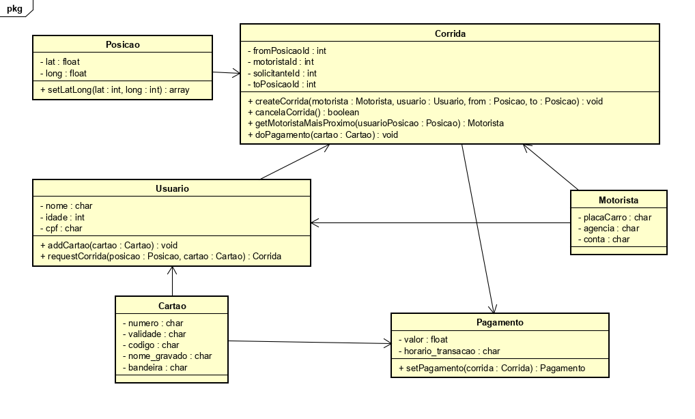

Diagrama de classes funciona como uma representação da estrutura e relações das classes que servem como modelo para objetos. De uma maneira mais simples, podemos dizer que seria um conjunto de objetos com as mesmas características, assim saberemos identificar objetos e agrupá-los, de forma a encontrar suas respectivas classes. 

Na Unified Modeling Language (UML) em diagrama de classe, uma classe é representada por um retângulo com três divisões, são elas: O nome da classe, seus atributos e por fim os métodos. Podemos ver na figura abaixo a sua representação:

A importância para encontrarmos as classes que estarão no nosso sistema, deve-se pois cada classe do diagrama representa uma tabela do banco de dados, por esse motivo é tão importante encontrarmos as classes. Observe também que para identificarmos uma classe, precisamos antes identificar seus objetos com características semelhantes.

Quando analisamos um cenário, somos capazes de identificar inúmeros objetos, contudo nem todo objeto será útil para nosso diagrama de classe, essa classificação dos objetos que iremos utilizar é chamado de Abstração. Abstração é a forma de concentrarmos apenas nos aspectos essenciais do nosso cenário.

Para o **desenvolvimento do nosso diagrama de classe, precisaremos de um cenário** qualquer onde realizaremos um passo a passo até abstrairmos todas as classes, a partir deste ponto, poderemos efetuar as ligações e cardinalidade.

| Característica | Descrição                                                                                                                                                                                             |
|----------------|-------------------------------------------------------------------------------------------------------------------------------------------------------------------------------------------------------|
| Estado         | O estado é a condição na qual um objeto pode existir. O estado de um objeto é implementado com um conjunto de atributos e normalmente se altera com o passar do tempo.                                |
| Comportamento  | O comportamento determina como um objeto responde a pedidos de outros objetos. O comportamento é implementado por um conjunto de operações.                                                           |
| Identidade     | A identidade de um objeto o torna exclusivo. Você pode utilizar a identidade exclusiva de um objeto para diferenciar entre múltiplas instâncias de uma classe se cada instância tiver o mesmo estado. |

### Lista de atributos da classe

A seção de atributo de uma classe (o compartimento do meio) lista cada um dos atributos da classe em uma linha separada. A seção de atributo é opcional, mas quando é usada, contém cada atributo da classe exibido em um formato de lista. A linha usa o seguinte formato:

ex:
* setPagamento: tipo de atributo

### Lista de operações de classe

As operações de classes são documentadas no terceiro compartimento (inferior) do retângulo de diagrama de classes que, e é opcional. Como os atributos, as operações de uma classe são exibidas em um formato de lista, com cada operação em sua própria linha. As operações são documentadas usando a notação a seguir:

ex:
* nome(lista de parâmetros) : tipo de valor retornado
