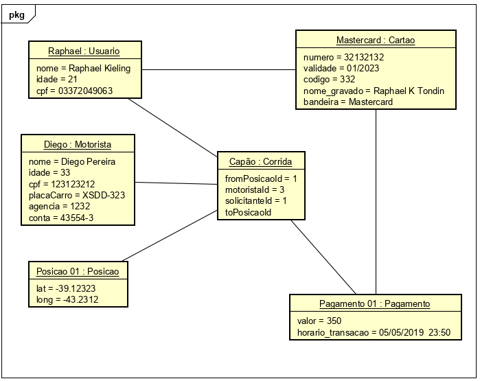

O diagrama de objetos representa uma instância específica de um diagrama de classes em um determinado momento, ou seja, o diagrama mostra um conjunto de objetos e seus relacionamentos em um ponto no tempo. Quando representado visualmente, você verá muitas semelhanças ao diagrama de classes. 

O diagrama incide sobre os atributos de um conjunto de objetos, e como eles se relacionam entre si. Diagramas de objetos não são usados apenas em casos de uso bancário. Você pode criar um diagrama de objetos para árvores genealógicas, departamentos corporativos ou qualquer outro sistema com partes inter-relacionadas.

Exemplo:

Diagramas de objetos são úteis nas seguintes situações:

- Durante a fase de análise de um projeto, você pode criar um diagrama de classes para descrever a estrutura de um sistema e criar um conjunto de diagramas de objetos como casos de teste para verificar a precisão e integridade do diagrama de classes.
- Antes de criar um diagrama de classes, você pode criar um diagrama de objetos para descobrir fatos sobre elementos de modelos específicos e seus links ou para ilustrar exemplos específicos de classificadores requeridos.
