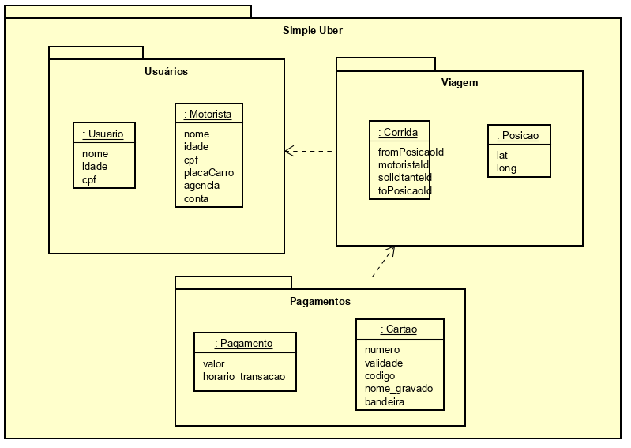

O diagrama de pacotes tem como seu objetivo principal agrupar classes em pacotes.  Esse diagrama é frequentemente utilizado para representar subsistemas, módulos ou parte da arquitetura de um sistema. Seu elemento principal é o pacote.

* Um pacote pode representar muitas coisas, dentre elas: uma camada, um módulo,
um subsistema, um espaço de nomes, etc. A ideia principal é a de que um pacote é um elemento capaz de agrupar outros elementos e ainda denominar tais grupos.
* Um pacote UML pode agrupar qualquer coisa: classes, outros pacotes,
casos de uso, etc.
* O elemento pacote pode ser utilizado em diversos outros diagramas
como o diagrama de classes ou o diagrama de casos de uso.

A linha de dependência UML pode ser utilizada para mostrar as
dependências entre pacotes ou entre elementos dos pacotes.

